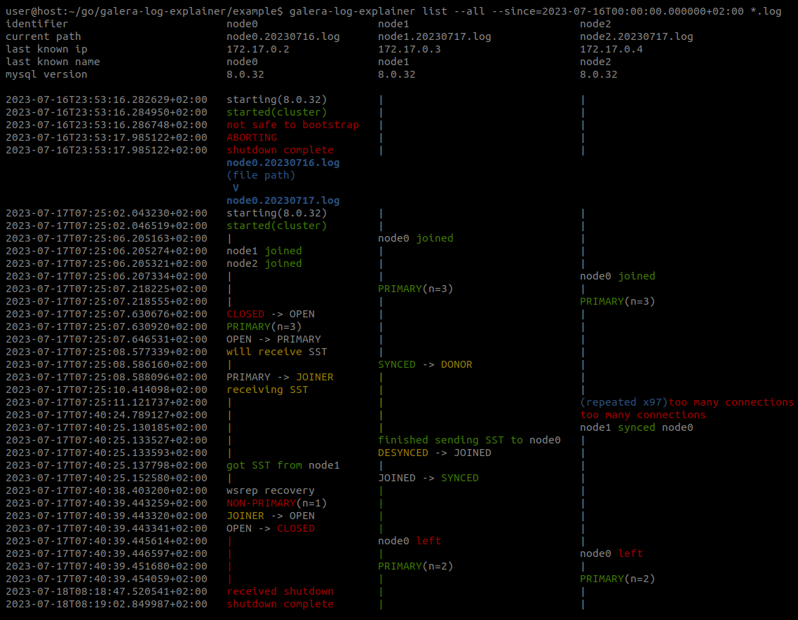
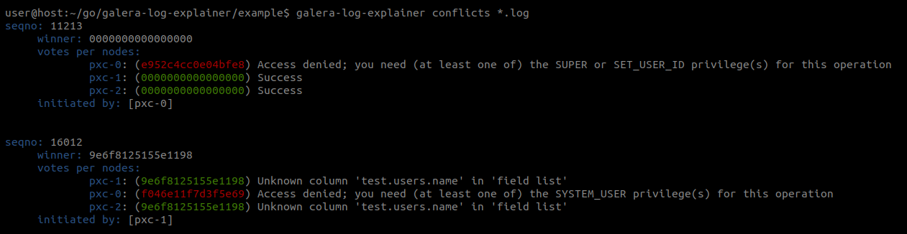

[](https://goreportcard.com/report/github.com/ylacancellera/galera-log-explainer) 

# pt-galera-log-explainer

Filter, aggregate and summarize multiple galera logs together.


## Features

* List events in chronological order from any number of nodes
* List key points of information from logs (sst, view changes, general errors, maintenance operations)
* Translate advanced Galera information to a easily readable counterpart
* Filter on dates with --since, --until
* Filter on type of events
* Aggregates rotated logs together, even when there are logs from multiple nodes

<br/><br/>
Get the latest cluster changes on a local server
```sh
pt-galera-log-explainer list --all --since 2023-01-05T03:24:26.000000Z /var/log/mysql/*.log
```

Or gather every log files and compile them
```sh
pt-galera-log-explainer list --all *.log
```


<br/><br/>
Find out information about nodes, using any type of info
```sh
pt-galera-log-explainer whois '218469b2' mysql.log 
{
	"input": "218469b2",
	"IPs": [
		"172.17.0.3"
	],
	"nodeNames": [
		"galera-node2"
	],
	"hostname": "",
	"nodeUUIDs:": [
		"218469b2",
		"259b78a0",
		"fa81213d",
	]
}
```

You can find information from UUIDs, IPs, node names
```
pt-galera-log-explainer whois '172.17.0.3' mysql.log 

pt-galera-log-explainer whois 'galera-node2' mysql.log 
```
<br/><br/>
List every replication failures (Galera 4)
```sh
pt-galera-log-explainer conflicts [--json|--yaml] *.log
```


<br/><br/>

Automatically translate every information (IP, UUID) from a log
```
pt-galera-log-explainer sed some/log.log another/one.log to_translate.log < to_translate.log  | less

cat to_translate.log | pt-galera-log-explainer sed some/log.log another/one.log to_translate.log | less
```
Or get the raw `sed` command to do it yourself
```
pt-galera-log-explainer sed some/log.log another/one.log to_translate.log
```
<br/><br/>
Usage:
```
Usage: pt-galera-log-explainer <command>

An utility to merge and help analyzing Galera logs 

Flags:
  -h, --help               Show context-sensitive help.
      --no-color
      --since=SINCE        Only list events after this date, format: 2023-01-23T03:53:40Z (RFC3339)
      --until=UNTIL        Only list events before this date
  -v, --verbosity=1        -v: Detailed (default), -vv: DebugMySQL (add every mysql info the tool used),
                           -vvv: Debug (internal tool debug)
      --pxc-operator       Analyze logs from Percona PXC operator. Off by default because it negatively
                           impacts performance for non-k8s setups
      --exclude-regexes=EXCLUDE-REGEXES,...
                           Remove regexes from analysis. List regexes using 'pt-galera-log-explainer
                           regex-list'
      --grep-cmd="grep"    'grep' command path. Could need to be set to 'ggrep' for darwin systems
      --grep-args="-P"     'grep' arguments. perl regexp (-P) is necessary. -o will break the tool

Commands:
  list <paths> ...

  whois <search> <paths> ...

  sed <paths> ...

  ctx <paths> ...

  regex-list

  version

  conflicts <paths> ...

Run "pt-galera-log-explainer <command> --help" for more information on a command.
```


## Compatibility

* Percona XtraDB Cluster: 5.5 to 8.0
* MariaDB Galera Cluster: 10.0 to 10.6
* Galera logs from K8s pods
